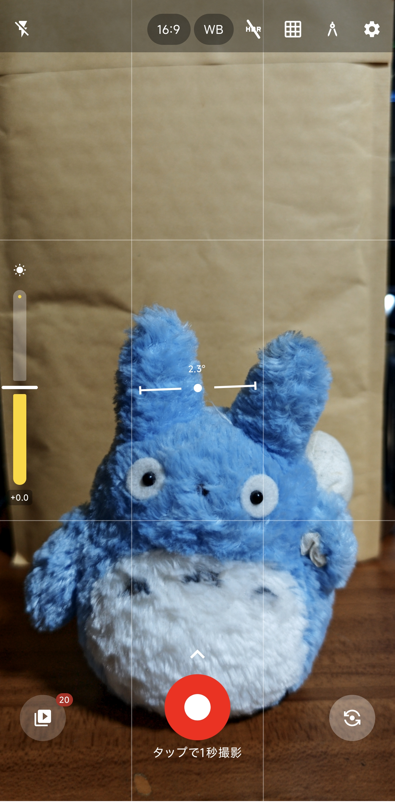
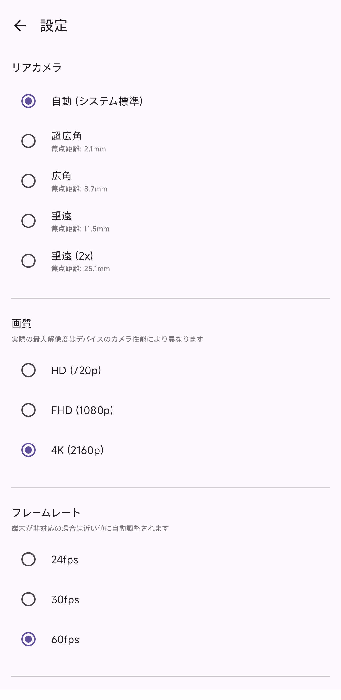
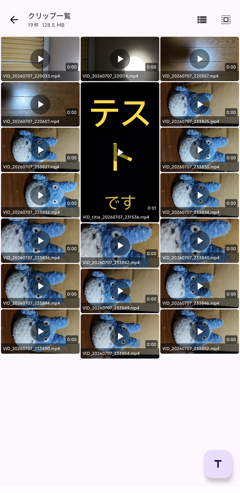
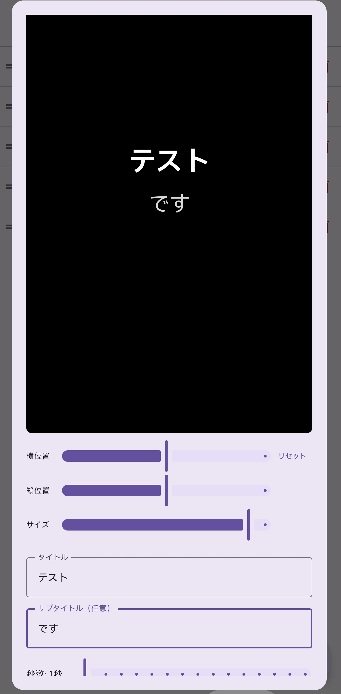
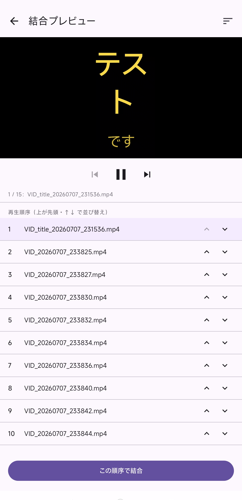

# ClipRecorder

**広告なし・トラッキングなし・クラウド不要**のオープンソース動画レコーダーです。クリップ管理と編集に特化しています。

[](LICENSE)
[](https://developer.android.com/about/versions/10)
[](https://ko-fi.com/udonnko)

---

## スクリーンショット

<p align="center">
  
  
  
  
  
</p>

---

## 機能

### 録画
- 縦・横どちらにも対応
- スローモーション・タイムラプスモード
- 録画前カウントダウンタイマー
- 動画メタデータへの GPS タグ埋め込み（任意）
- ホーム画面ウィジェットでワンタップ録画開始

### クリップ管理
- リスト表示・グリッドサムネイル表示（秒数表示付き）
- ドラッグ＆ドロップで並び替え
- 縦・横の向きを正しく反映したサムネイル

### 編集
- **16 種類のビデオエフェクト**：グレースケール・セピア・明度・コントラスト・彩度・ウォーム・クール・ヴィヴィッド・マット・フィルムグレイン・色収差・ビネット・シネマティック・ケン・バーンズ・フェードイン/アウト
- BGM ミキシング
- GIF エクスポート

### タイトルカード
- テキスト・サブタイトル・背景色を自由に設定して動画タイトルカードを生成
- 秒数（1〜15秒）・向き・文字色・位置・サイズを調整可能
- 縦書き対応
- 生成したタイトルカードをクリップ一覧に追加して並び替え・結合できる

### 結合
- 複数クリップを任意の順番で結合
- 結合前にプレビューで確認
- タイトルカードとカメラ映像の混在に対応

---

## プライバシー

- インターネットパーミッションなし
- アナリティクス・クラッシュレポートなし
- すべての処理をデバイス内で完結

---

## ビルド方法

```bash
git clone https://github.com/udonnko/ClipRecorder.git
cd ClipRecorder
```

Android Studio で開き、ビルドバリアントを **`fdroidDebug`** に切り替えてビルドしてください。

| 要件 | バージョン |
|------|-----------|
| Android Studio | Hedgehog 以降 |
| Kotlin | 2.x |
| 最小 SDK | Android 10 (API 29) |
| ターゲット SDK | Android 15 (API 35) |

---

## 支援

このアプリが役に立ったら Ko-fi で支援していただけると嬉しいです。

[](https://ko-fi.com/udonnko)

---

## ライセンス

[Apache License 2.0](LICENSE)
